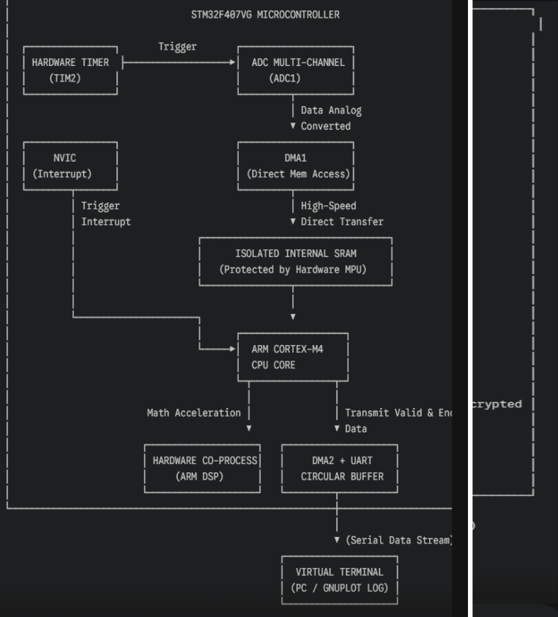
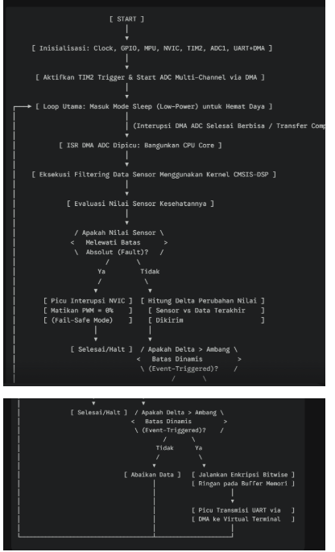
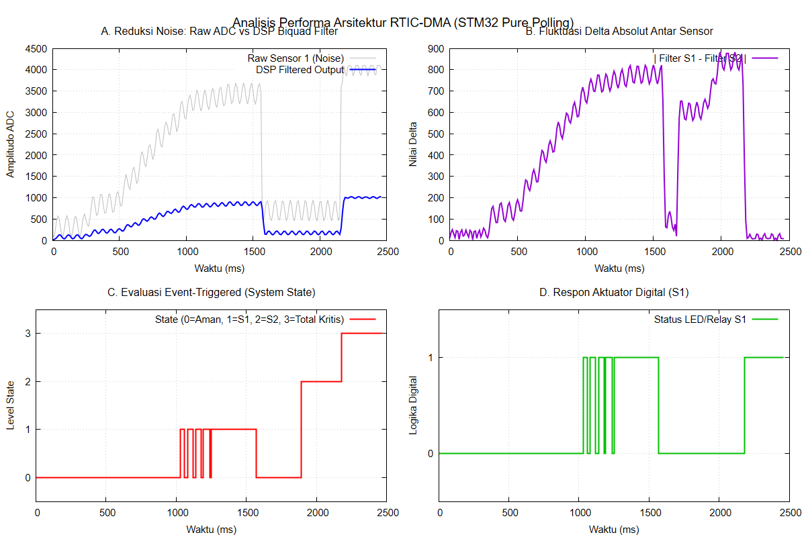

# RTIC-Polling: Real-Time Isolated Computing via Synchronized Pure-Polling Architecture

## 1. Project Description & Background
This project proposes a radical paradigm shift in sensor acquisition and actuator control for safety-critical embedded systems. 

**Background:** A comprehensive literature review of recent high-impact journals (including studies on RISC-V Software-Level Interrupt Controllers, FPGA Hardware Preemptive Schedulers, and complex Fuzzy Optimal Control dynamics) reveals a systemic vulnerability. Modern embedded architectures attempt to solve multi-sensor integration by introducing highly complex Interrupt-Driven mechanisms, advanced scheduling overheads, and heavy Floating-Point Unit (FPU) dependencies. In high-noise industrial environments, these nested interrupts inevitably lead to unpredictable interrupt latency, context-switching overhead, and race conditions.

**The Proposed Novelty:** Instead of managing interrupt complexity, this project eliminates it. We propose a **Synchronized Pure-Polling Architecture**. By deliberately completely disabling the NVIC (Nested Vectored Interrupt Controller) and DMA, the microcontroller operates in a deterministic, absolute sequential loop. Furthermore, the system integrates an **Event-Triggered Logic** and a **CMSIS-DSP Biquad Cascade DF1 Filter** utilizing strict fixed-point (integer) arithmetic, bypassing FPU bottlenecks entirely.

## 2. System Block Diagram & Flowchart
*The architecture isolates the DSP execution within the main loop, guaranteeing constant execution time without interrupt preemption.*

*(Note: Diagram maps the isolated flow from Dual Analog Sensors -> ADC1 Manual Trigger -> Cortex-M3 DSP Core -> Event-Triggered Evaluator -> GPIO/UART Output).*

*(Note: The flowchart illustrates the strict sequential polling loop, eliminating the conventional preemptive scheduling tree).*

## 3. Simulation Execution Steps (Keil C/C++ & Proteus)
This architecture is validated strictly bypassing Rust/hardware-level schedulers, focusing on a robust C-based toolchain:
1. **STM32 Configuration (Keil uVision):** Configure the STM32F103 peripheral registers. ADC1 is locked to Software Trigger (Polling mode). USART1 is configured at 115200 Baud for telemetry.
2. **Circuit Simulation (Proteus 8):** Load the compiled `.hex` binary. To simulate harsh industrial environments (as discussed in multi-sensor integration literature), AC SINE wave generators are injected over DC potentiometers (PA1 & PA2) to create dynamic noise floors.
3. **Data Acquisition:** The STM32 executes the integer-DSP algorithm and transmits a formatted CSV data stream via UART polling. Data is logged via the Proteus Virtual Terminal.
4. **Data Visualization:** The multi-variable dynamics are plotted using a custom GNUPlot script (`.gp`) to analyze real-time system responses.

## 4. Simulation Results and Analytical Insights

The empirical data yielded four critical insights regarding system stability:
* **A. Algorithmic Noise Reduction:** The fixed-point Biquad filter successfully attenuated high-frequency injected noise without FPU hardware acceleration. Note: An inherent DC Gain attenuation (0.25) dictates the need for software-level scaling compensation.
* **B. Dynamic Delta Tracking:** The absolute delta logically tracks asymmetric environmental changes, proving multi-sensor reliability without preemptive scheduling.
* **C. Deterministic State Evaluation:** The Event-Triggered system accurately elevated safety states based on strict integer thresholds.
* **D. Actuator Chattering (Vulnerability Discovery):** Actuator chattering occurred between 1000ms-1300ms as the filtered signal oscillated precisely at the single-point threshold. This exposes a critical flaw in single-threshold logic. Future work must implement a Schmitt Trigger (Hysteresis Band) to protect mechanical relays, a detail often overlooked in theoretical fuzzy control models.

## 5. Method Advantages Over Current Literature
Compared to the preemptive schedulers and complex control dynamics analyzed in the reference journals, this RTIC-Polling method provides:
1. **Absolute Determinism (Zero-Interrupt Jitter):** Pure polling guarantees invariable CPU cycle times. By eliminating preemptive interruptions, the system acts as a true safety-critical failsafe.
2. **Zero FPU Overhead:** Utilizing mathematical integer scaling for DSP prevents the microcontroller from stalling on complex float calculations, maintaining high sampling rates on standard Cortex-M3 cores.
3. **Event-Triggered Energy Efficiency:** Physical actuators execute only during critical state transitions (derived from the dynamic delta), avoiding the redundant actuation cycles inherent in continuous time-driven systems.
